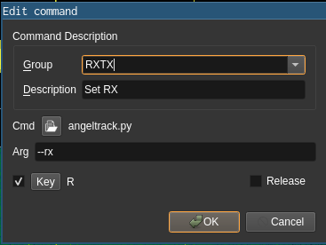
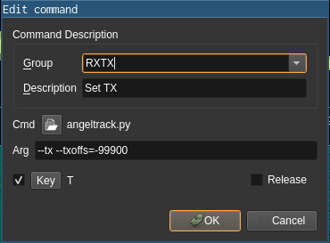

# angeltrack - RX/TX frequency tracking for sdrangel
This script uses the REST API of sdrangel to allow for transmit/receive switching and frequency tracking for sdrangel. It accomplishes this by reading/writing the inputFrequencyOffset property of the modulator and demodulator.

## Operation
This script allows you to configure a key binding for receive (R) and transmit (T) in sdrangel. On transmit, the modulator offset frequency is automatically tuned according to the current RX frequency. In case offset tuning is used for SDR transmitters (to avoid LO feedthrough), a TX frequency offset can be specified.

## Prerequisites
Set up sdrangel with a receiver channel as device 0 and a transmitter channel as device 1. Create SSB modulator and demodulator respectively. Calculate/measure the offset between RX and TX frequencies with the respect to the demodulator/modulator offset.

## Setup
Step 1: Clone this repository

Step 2: In the 'commands' panel, set up keybindings for angeltrack as shown in the following images (TX offset is optional and can be omitted if not required)

Step 3: Enable the keybindings using the small keyboard-button in the 'commands' panel.
